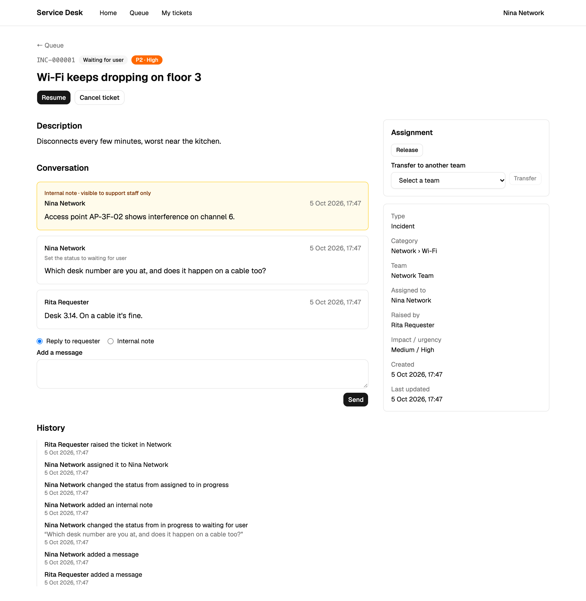
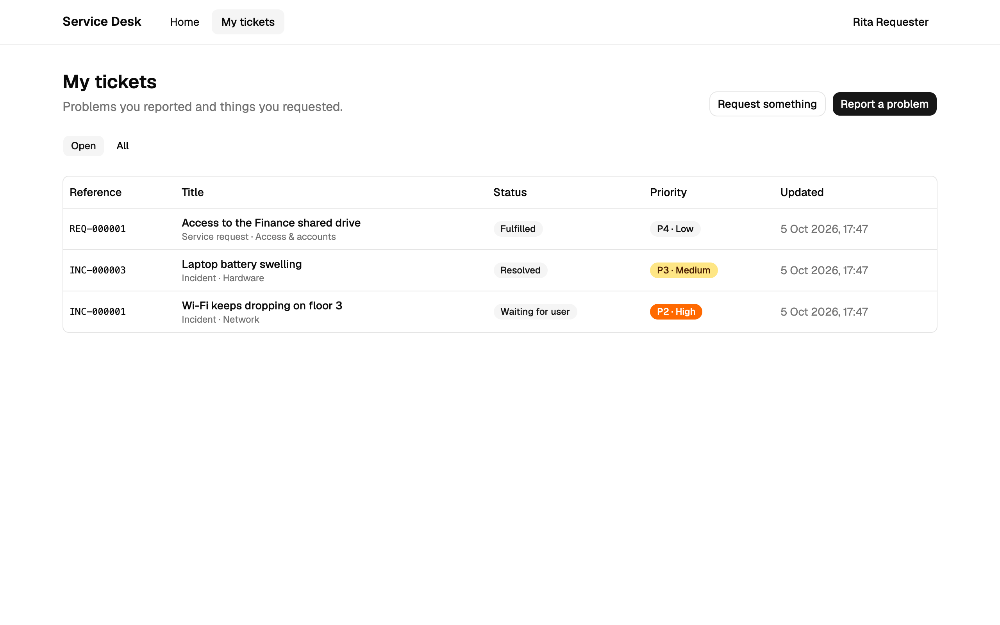
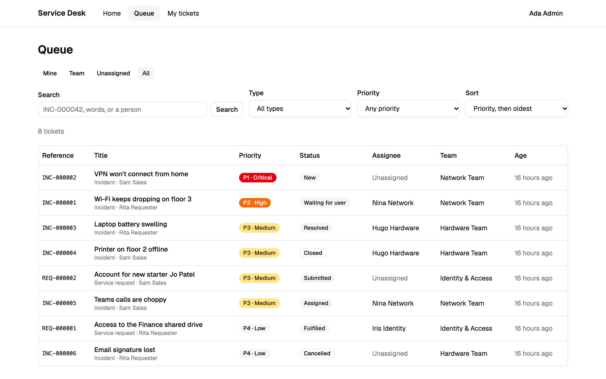
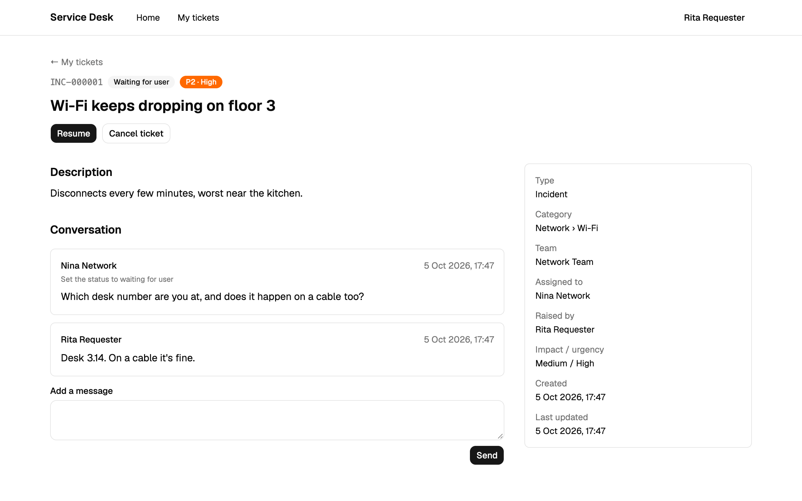
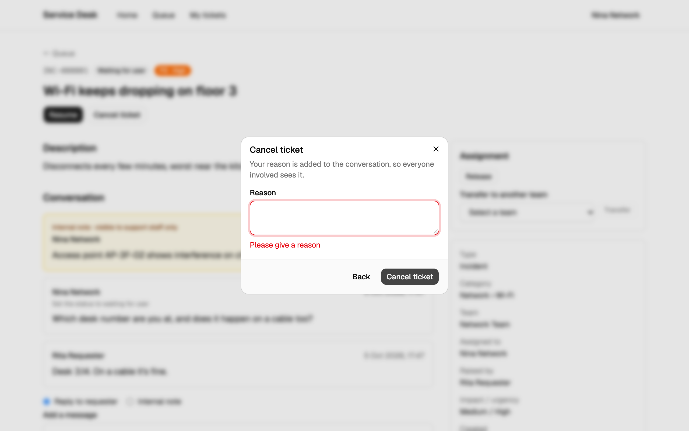
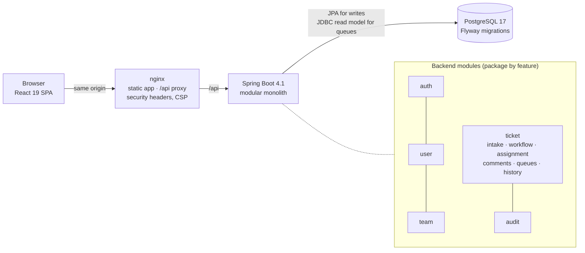

# Enterprise Service Management Platform

[](https://github.com/Adebozz/enterprise-service-management/actions/workflows/ci.yml)

A full-stack IT service desk in the spirit of a focused ServiceNow / Jira Service Management.
Employees report incidents and request things; support teams triage, assign, investigate and
resolve them under explicit workflows, with internal notes and a complete, tamper-resistant audit
trail.

**Java 21 · Spring Boot 4.1 · PostgreSQL 17 · React 19 + TypeScript · Docker · GitHub Actions**

> **Status: Phase 1 (MVP) complete.** Everything described here is built and tested. Planned work
> is listed separately under [Roadmap](#roadmap) and labelled as planned.



## Try it in one command

Prerequisite: Docker.

```bash
cp .env.example .env && docker compose up --build
```

Open **http://localhost:3000** and sign in with a demo account. The password for every account is
the `ESM_DEMO_PASSWORD` value in `.env` (local demos only).

| Email | Role | Try |
|---|---|---|
| `rita@demo.local` | Requester | My tickets, answer the agent's question, confirm a resolved incident |
| `sam@demo.local` | Requester | Report a problem or request something |
| `nina@demo.local` | Agent (Network) | Queue, take/resolve, internal notes, history |
| `hugo@demo.local` | Agent (Hardware) | Another team's queue |
| `iris@demo.local` | Agent (Identity & Access) | Service requests |
| `lead@demo.local` | Team lead (Network) | Assign work to team members |
| `admin@demo.local` | Administrator | Every ticket |

The demo data is created through the real application services on first start: 7 people,
3 teams, 9 categories and 8 tickets across their lifecycles, each with a genuine audit history.

## What it does

**For requesters**
- Report a problem (incident) or request something (service request), with categories that route
  the ticket to the right team automatically.
- Priority is derived from impact × urgency through a configurable matrix, never typed in.
- Follow their own tickets, reply in the conversation, confirm a resolution or reopen it.

**For support staff**
- Queues: *mine*, *team*, *unassigned* and *all*, with full-text search, filters and priority-first
  sorting. All of it is URL-driven, so every view can be bookmarked.
- Take, release, assign (team leads) and transfer tickets between teams.
- Workflow actions with the inputs each move requires: a reason to cancel or reopen, a resolution
  code and notes to resolve, delivery notes to fulfil.
- Internal notes that requesters never see. The filtering happens in SQL, not in the browser.
- A readable history of every change, built from the audit trail.

| Requester | Agent |
|---|---|
|  |  |
|  |  |

More: [sign-in](docs/screenshots/01-sign-in.png) · [reporting a problem](docs/screenshots/03-requester-new-incident.png)

## Engineering highlights

- **The backend enforces every rule.** Role checks, ticket visibility, workflow permissions and
  assignment rules live in the services and the database. The frontend only hides what the
  server would refuse anyway. A ticket the caller may not see returns 404, not 403, so its
  existence isn't leaked.
- **Workflows are data.** Each lifecycle is a declarative table of moves: who may make each one
  and what it requires. The entity enforces it, the API publishes the moves available to the
  caller right now, and the UI renders buttons from that list. Because the UI never encodes the
  workflow, it can't drift from the backend ([ADR-007](docs/adr/007-workflow-as-data.md)).
- **Authentication:**
  - short-lived JWT access tokens, kept in memory only;
  - opaque refresh tokens in an HttpOnly, SameSite=Strict cookie, stored as SHA-256 hashes and
    rotated on every use;
  - reuse detection that revokes the whole session family;
  - timing-safe login ([security model](docs/security.md)).
- **Audit trail you can trust.** Audit entries are written in the same transaction as the change
  (`Propagation.MANDATORY`), and a database trigger rejects any update or delete
  ([ADR-006](docs/adr/006-transactional-audit-trail.md)).
- **Correctness under concurrency:**
  - optimistic locking (the client sends the version it saw) on users, teams, categories and
    ticket changes;
  - pessimistic locks where a check-then-act would race (last admin, refresh-token rotation);
  - per-type sequences for references (`INC-000042`);
  - database triggers for team-membership rules.
- **Queues on a hand-written SQL read model.** Visibility is part of the WHERE clause, and search
  uses PostgreSQL full-text search with a GIN index. Index use is verified by plan tests on 100k
  realistic rows ([ADR-009](docs/adr/009-sql-read-model-for-queues.md),
  [performance notes](docs/performance.md)).
- **A typed contract end to end.** The OpenAPI 3.1 contract has exact nullability and typed errors.
  It's snapshot-tested against the code, and the frontend's TypeScript types are generated from it,
  so CI fails if either side drifts.
- **One error shape** everywhere: RFC 9457 problem details with a stable `code` and a
  `correlationId` that matches the logs.

## Architecture



A **modular monolith**, packaged by feature. Modules refer to each other's aggregates by ID, and the
dependency graph is one-way: cycles are broken with synchronous domain events and dependency
inversion ([ADR-001](docs/adr/001-modular-monolith.md)). Controllers are thin and never expose JPA
entities; business rules live in services and entities. The full picture is in
[docs/architecture.md](docs/architecture.md).

## Tech stack

**Backend:** Java 21, Spring Boot 4.1 (Web MVC, Data JPA/Hibernate 7, Security 7, Validation,
Actuator), PostgreSQL 17, Flyway, springdoc-openapi.
**Frontend:** React 19, TypeScript 5.9 (strict), Vite 8, Tailwind CSS 4, shadcn/ui (Radix), React
Router 7, TanStack Query 5, React Hook Form + Zod 4, openapi-fetch + openapi-typescript.
**Testing:** JUnit 5, AssertJ, Mockito, Spring Boot Test, Testcontainers, JaCoCo; Vitest, React
Testing Library, MSW.
**Delivery:** Docker (multi-stage, non-root images), Docker Compose, nginx, GitHub Actions,
Dependabot.

## Testing and CI

| Suite | What it covers |
|---|---|
| Backend unit tests (`*Test`) | Domain rules: workflows, priority matrix, access policy, assignment, tokens |
| Backend integration tests (`*IT`) | The real application against real PostgreSQL 17 in Testcontainers (no H2): HTTP → security → services → SQL constraints and triggers, query plans, the API contract snapshot |
| Frontend tests | The real app and routes against a mocked API (MSW): sign-in and session refresh, requester and agent flows, validation, error handling |
| Smoke test | The running Docker stack through nginx: headers, proxy, error format, demo sign-in, role enforcement |

```bash
cd backend && ./mvnw verify          # format check, unit + integration tests, contract, coverage floors
cd frontend && npm test && npm run typecheck && npm run lint
docker compose up --build --wait && ./scripts/smoke-test.sh
```

`verify` fails if coverage drops below 90% lines and 80% branches overall, or below 90% / 85% in the
security- and rule-critical packages (auth, ticket access, assignment, priority, transitions,
workflow).

[CI](.github/workflows/ci.yml) runs all of this on every pull request and push to `main`, as three
parallel jobs:
- **backend:** `./mvnw verify`;
- **frontend:** lint, types, the generated-API-types check, tests and a production build;
- **stack:** builds both images, starts Compose and runs the smoke test.

Actions are pinned to commit SHAs and the workflow token is read-only.
[Dependabot](.github/dependabot.yml) proposes weekly dependency updates.

## Developing locally

Prerequisites: JDK 21, Node 22 and Docker.

```bash
cp .env.example .env
docker compose up -d --wait postgres   # database only, on localhost:5432
cd backend && ./mvnw spring-boot:run   # API on http://localhost:8080
```

```bash
cd frontend && npm install && npm run dev   # web app on http://localhost:5173
```

Flyway migrates the database on start-up. The first admin account is created from the
`ESM_BOOTSTRAP_ADMIN_*` values in `.env` (local development only). Swagger UI is at
http://localhost:8080/swagger-ui.html. `./mvnw spring-boot:test-run` starts the backend against a
throwaway Testcontainers database instead. Run `./mvnw spotless:apply` before committing backend
code.

## Repository layout

```
enterprise-service-management/
├── backend/             Spring Boot application, migrations, tests
├── frontend/            React + TypeScript web app, nginx config (see frontend/README.md)
├── docs/                Architecture, database, security, API, ADRs, screenshots
├── scripts/             End-to-end smoke test
├── docker/              Compose support files (Postgres init script)
├── .github/             CI workflow and Dependabot
├── docker-compose.yml   Full local stack, or the database alone
└── .env.example         Local configuration template (copy to .env, never commit .env)
```

## Documentation

- [Architecture](docs/architecture.md) · [Database design](docs/database.md) ·
  [Security model](docs/security.md) · [Performance notes](docs/performance.md)
- [API reference](docs/api.md) and the [OpenAPI contract](docs/openapi.json)
- [Deployment & containers](docs/deployment.md)
- [Architecture Decision Records](docs/adr)
- [Portfolio notes](docs/portfolio-notes.md): what was built in each milestone, and why

## Roadmap

**Phase 1 (done):** everything above. The milestone list is in
[docs/architecture.md](docs/architecture.md#phase-1-milestones).

**Not built yet:**
- **Phase 2 (planned):**
  - SLA engine (response/resolution targets, breach tracking);
  - service catalogue and approvals;
  - problem and change management;
  - attachments (S3);
  - notifications;
  - an admin UI (users, teams and categories are managed through the API today).
- **Phase 3 (planned):**
  - reporting dashboards;
  - load testing;
  - AWS deployment (ECS Fargate, RDS, S3, CloudFront) with Terraform;
  - login rate limiting at the edge.

Known limitations are listed in [docs/security.md](docs/security.md#known-limitations-security)
and [docs/performance.md](docs/performance.md#known-future-work).
