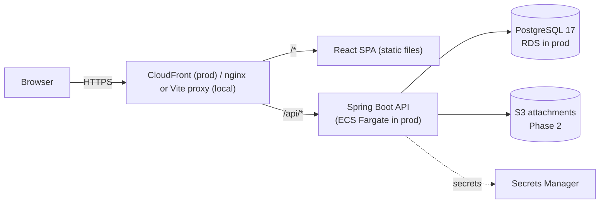
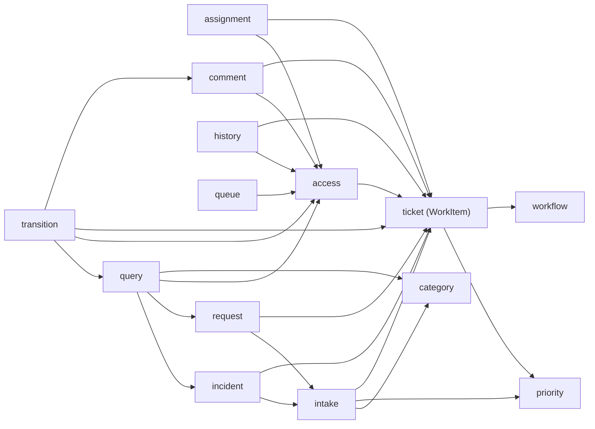
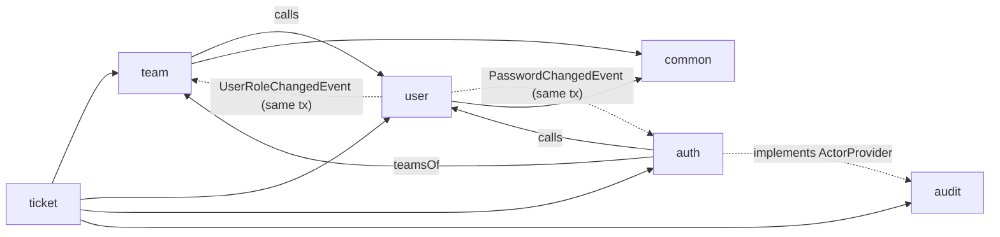
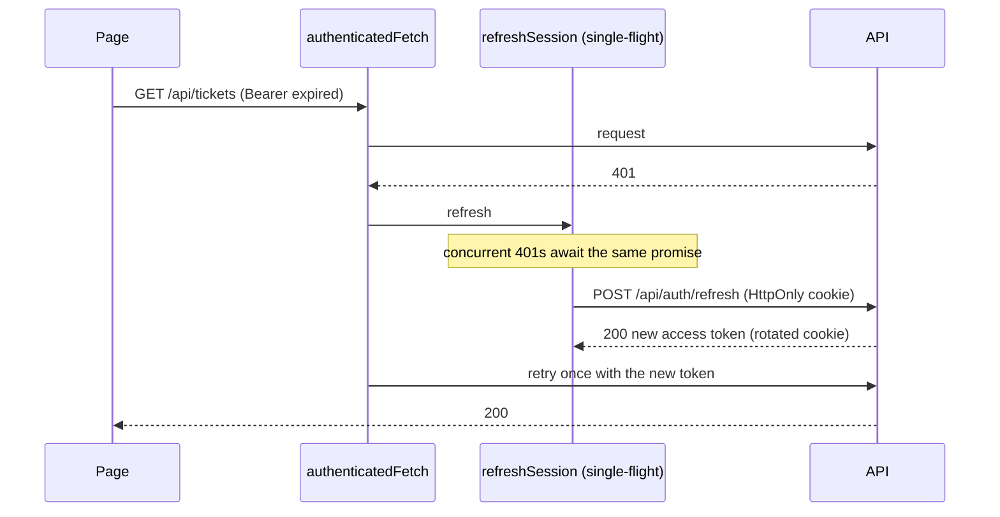
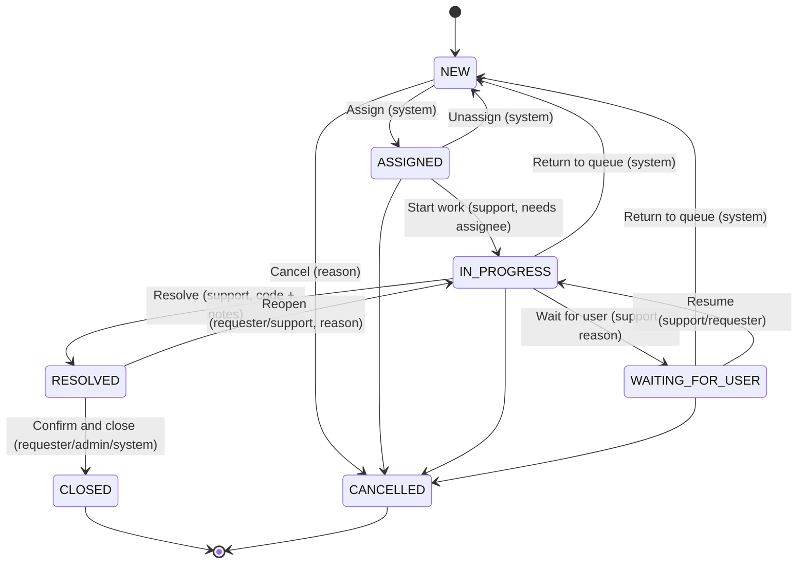
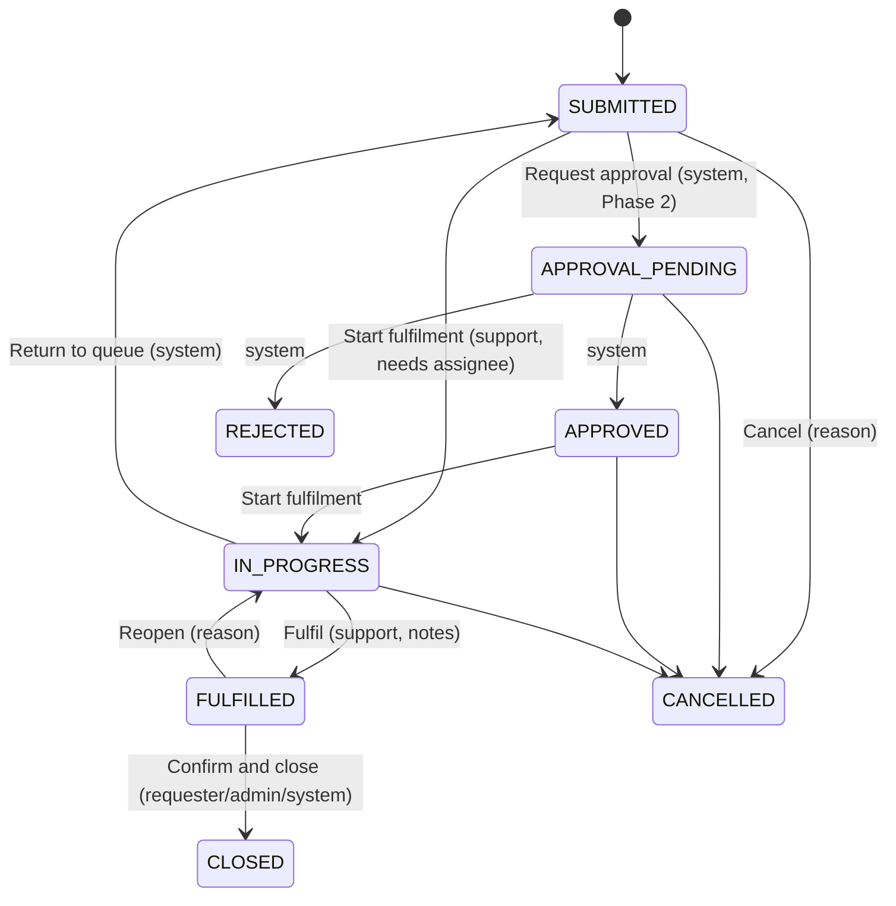

# Architecture

> Sections marked **(planned)** describe approved design that isn't implemented yet. They're updated
> as each milestone lands.

## Style: modular monolith

One deployable Spring Boot application, split internally into domain modules with explicit
boundaries. See [ADR-001](adr/001-modular-monolith.md).

**The SPA and API share one origin.** `/api/*` is routed to the backend by the edge (CloudFront in
production, the Vite dev proxy or nginx locally). This removes CORS from production and lets the
refresh-token cookie be `SameSite=Strict`.

## Backend modules

Base package: `com.ademola.esm`

| Module | Responsibility | Status |
|---|---|---|
| `common` | Error model (`ErrorCode`, `DomainException`, `GlobalExceptionHandler`), web (`CorrelationIdFilter`, `PageResponse`, `SortableFields`), persistence (`BaseEntity`), injectable `Clock` | Implemented (M0–M1) |
| `config` | Cross-cutting Spring configuration (OpenAPI, later Jackson/web) | Implemented (M0) |
| `auth` | Security filter chain, role hierarchy, JWT issue/validation, refresh-token rotation, login/refresh/logout, `/api/users/me` | Implemented (M0–M2) |
| `user` | Users, roles, password hashing and change, first-admin bootstrap, admin user API | Implemented (M1–M2) |
| `team` | Teams, membership, admin team API, team read API | Implemented (M1) |
| `ticket` | Work-item kernel (`WorkItem`, references) plus `priority`, `category`, `intake`, `incident`, `request`, `access`, `query`, `workflow` (engine), `transition` (API), `assignment`, `comment`, `history`, `queue` sub-packages | Implemented (M3–M7) |
| `audit` | Append-only audit trail; `ActorProvider` port implemented by `auth` | Implemented (M3) |
| `sla`, `catalogue`, `approval`, `attachment`, `notification` | Phase 2 | Planned |
| `reporting` | Read-only aggregate queries | Planned (Phase 3) |

### Module conventions

- **Package by feature, not by layer.** Each module holds its own controller, service, repository,
  entities and DTOs. Classes are package-private where possible, so the compiler enforces
  boundaries.
- **Controllers are thin.** They validate input, call one service method, and map the result to a
  response DTO. Business rules live in services and entities.
- **JPA entities never leave the service layer.** Controllers return Java `record` DTOs.
- **No Lombok or MapStruct.** Records and explicit mapping methods keep the code transparent.
- **Modules reference each other's aggregates by ID**, not JPA associations. For example,
  `TeamMember` stores a `userId`.
- **Dependencies point one way, and events carry the reverse direction.** `team` depends on `user`.
  When `user` needs `team` to react (a user demoted to REQUESTER must leave all teams), it publishes
  `UserRoleChangedEvent` and `team` listens. Listeners are synchronous and run in the same
  transaction, so the change is atomic. Phase 2 uses the same pattern for ticket → SLA.

Inside `ticket`, packages form a one-way graph (no cycles):

Across modules:

## Request lifecycle (implemented)

1. `CorrelationIdFilter` (highest precedence) accepts a safe `X-Request-Id` or generates one, stores
   it in the SLF4J MDC, and echoes it in the response.
2. The Spring Security filter chain runs. `BearerTokenAuthenticationFilter` verifies the JWT, and
   `CurrentUserJwtConverter` turns its claims into a `CurrentUser` principal. URL rules then apply
   (public: health, docs, `/api/auth/*`; ADMIN: `/api/admin/**`; everything else needs
   authentication).
3. Spring MVC dispatches to a controller.
4. Any exception, including authentication and access-denied failures delegated from Spring
   Security, is rendered by `GlobalExceptionHandler` as `application/problem+json`.

## Frontend (M9)

React 19 + TypeScript (strict) single-page app in `frontend/` (details in `frontend/README.md`).

- **Typed contract end to end:** `docs/openapi.json` (guarded by `ApiContractIT`) → `openapi-typescript`
  → `src/api/schema.d.ts` (guarded by `npm run check:api`) → `openapi-fetch`. Paths, parameters,
  bodies, responses and error codes are all compiler-checked; a backend change that breaks the
  frontend fails `tsc`.
- **Authentication:**

  If the refresh fails, the session ends and the app shows the login page. There's no retry loop.
- **State:** server data in TanStack Query (cache cleared on sign-out); only "who is signed in" in
  React context.
- **Routing:** `RequireAuth` redirects anonymous users to `/login` and back afterwards (only
  same-app paths, so it can't become an open redirect). Role checks are UX only.

### Requester portal (M10)

| Route | Page |
|---|---|
| `/tickets` | My tickets (`view=REQUESTED`), Open/All filter and page in the URL |
| `/tickets/new/incident`, `/tickets/new/request` | Forms with category → dependent subcategory |
| `/tickets/:id` | Details, public conversation + reply, action buttons |

- **Action buttons come from `GET /transitions`**: the UI never encodes the workflow. Moves
  needing a reason open a dialog; moves needing resolution/fulfilment inputs are support-only and
  get their forms in M11.
- **Optimistic locking in the UI:** moves send the ticket's `version`; on 409 the page explains
  that someone else changed the ticket and reloads it rather than overwriting.
- **Forms:** Zod mirrors server validation for instant feedback; server `fieldErrors` and codes
  such as `INVALID_CATEGORY` are mapped onto the matching field.
- **Cache:** hierarchical query keys (`['tickets', …]`), so one invalidation refreshes lists and
  detail after any change.

### Agent portal (M11)

| Route | Page |
|---|---|
| `/queue` (AGENT+) | Tabs Mine / Team / Unassigned / All; search, type and priority filters; sort (default priority then oldest, "best match" when searching); all in the URL |
| `/tickets/:id` (staff view) | Plus an assignment panel, a resolve/fulfil dialog, internal notes and a history timeline |

- **Typed resolution codes:** `TransitionRequest.resolutionCode` is an enum in the contract, and
  the UI's labels are a `Record<ResolutionCode, string>`, so a new backend code fails the frontend
  build until it is labelled.
- **History with names:** the history API resolves user, team and category ids found in audit
  values (`names` map, one query per kind), and the UI turns entries into sentences
  (`historyText.ts`, unit-tested).
- **Transfers:** after moving a ticket to another team the agent may lose access (by design), so
  the UI returns to the queue with a notice instead of showing "not found".
- **Code splitting:** pages behind sign-in are React Router `lazy` routes. The main bundle went from
  596 KB (188 KB gzipped) to 434 KB (137 KB gzipped) while the app grew.

## Configuration

- 12-factor: environment variables (`ESM_DB_URL`, `ESM_DB_USERNAME`, `ESM_DB_PASSWORD`, ...).
- Locally, Spring imports the git-ignored repository-root `.env` (`spring.config.import`), so
  docker-compose and the backend read the same single file.
- The `prod` profile switches to JSON (ECS) structured logs and disables API docs.
- `spring.jpa.open-in-view=false` stops lazy loading during JSON rendering, which would hide N+1
  queries.
- `ddl-auto=validate`: Flyway owns the schema, and Hibernate only verifies it.

## API (implemented so far)

The full reference is [api.md](api.md) and the machine-readable contract is
[openapi.json](openapi.json), guarded by `ApiContractIT`. The tables below summarise by milestone.

| Method & path | Who | Notes |
|---|---|---|
| `POST /api/auth/login` | anyone | `{email, password}` → `{accessToken, tokenType, expiresIn, user}` + refresh cookie |
| `POST /api/auth/refresh` | refresh cookie | Rotates the cookie, returns a new access token |
| `POST /api/auth/logout` | refresh cookie | 204; revokes the session family, clears the cookie |
| `GET /api/users/me` | any signed-in user | Profile + active teams |
| `POST /api/users/me/password` | any signed-in user | `{currentPassword, newPassword}`; 204; ends all sessions |
| `POST /api/admin/users` | ADMIN | 201 + `Location`; 409 `EMAIL_ALREADY_EXISTS` |
| `GET /api/admin/users?q&role&active&page&size&sort` | ADMIN | Paged; sort by `email`, `displayName`, `role`, `createdAt` |
| `GET /api/admin/users/{id}` | ADMIN | |
| `PATCH /api/admin/users/{id}` | ADMIN | `{displayName?, role?, active?, version}`; 409 on stale version or last admin |
| `GET /api/teams`, `GET /api/teams/{id}`, `GET /api/teams/{id}/members` | AGENT+ | Active teams only |
| `GET /api/admin/teams`, `POST /api/admin/teams`, `PATCH /api/admin/teams/{id}` | ADMIN | Includes inactive teams |
| `PUT / DELETE /api/admin/teams/{id}/members/{userId}` | ADMIN | Idempotent, 204 |

### Tickets & categories (M3)

| Method & path | Who | Notes |
|---|---|---|
| `POST /api/incidents` | any signed-in user | `{title, description, categoryId, subcategoryId?, impact, urgency, affectedService?}` → 201 `{id, reference, type, status, priority}` + `Location: /api/tickets/{id}` |
| `POST /api/service-requests` | any signed-in user | `{title, description, categoryId, subcategoryId?, urgency?}`; impact defaults LOW, urgency MEDIUM |
| `GET /api/tickets/{id}` | owner / team staff / admin | Full ticket with names resolved; **404** if not visible |
| `GET /api/categories?type=INCIDENT\|SERVICE_REQUEST` | any signed-in user | Active category tree for that type |
| `GET/POST /api/admin/categories`, `PATCH /api/admin/categories/{id}` | ADMIN | Code is immutable; top level needs a team; max two levels |

### Workflow (M4)

| Method & path | Who | Notes |
|---|---|---|
| `GET /api/tickets/{id}/transitions` | anyone who can see the ticket | Moves available to *this caller* now: `[{targetStatus, label, requirements}]`. The UI renders buttons from it |
| `POST /api/tickets/{id}/transitions` | depends on the move | `{targetStatus, version, reason?, resolutionCode?, notes?}` → updated ticket |

### Assignment (M5)

| Method & path | Who | Notes |
|---|---|---|
| `PUT /api/tickets/{id}/assignment` | AGENT+ (see rules) | `{teamId, assigneeId?, version}` → `{ticketId, reference, status, assignedTeam, assignee, version}`. Same values = no-op |

### Comments & history (M6)

| Method & path | Who | Notes |
|---|---|---|
| `GET /api/tickets/{id}/comments` | anyone who can see the ticket | Oldest first. Internal notes only for support on this ticket and admins |
| `POST /api/tickets/{id}/comments` | anyone who can see the ticket | `{visibility: PUBLIC\|INTERNAL, body}` → 201. INTERNAL: support/admin only (403). Closed tickets: 409 `TICKET_CLOSED` |
| `GET /api/tickets/{id}/history` | support on this ticket, admins | Audit timeline: `[{occurredAt, actor, action, oldValue, newValue, metadata}]`; requesters 403 |

### Queues & search (M7)

| Method & path | Who | Notes |
|---|---|---|
| `GET /api/tickets` | any signed-in user | Paged `TicketSummary` rows the caller may see. `view=ALL\|REQUESTED\|MINE\|TEAM\|UNASSIGNED`; filters `type, status, priority` (repeatable or comma-separated), `teamId, assigneeId, categoryId` (also matches subcategory), `createdFrom/createdTo` (inclusive UTC days), `open=true`, `q`; `sort` by `createdAt, updatedAt, priority, reference, status, title`; default newest first, or by relevance when searching |

## Ticket intake (M3)

Every new ticket, of any type, goes through `TicketIntake`, in one transaction:

1. **Category check:** active, top-level, applicable to the type; the subcategory must belong to it.
   Failures are 422 `INVALID_CATEGORY` (never 404, which would allow probing for ids).
2. **Routing:** subcategory team ?? category team; that team must be active.
3. **Priority:** `PriorityPolicy` (below).
4. **Reference:** `nextval` on the type's sequence → `INC-000042`.
5. Save, then **audit** `TICKET_CREATED` in the same transaction.

### Priority matrix

Configured in `application.yml` (`esm.priority.matrix`), bound to a validated record. Startup
fails if any cell is missing. `PriorityPolicy` is the only code that maps impact/urgency to
priority.

| Impact \ Urgency | HIGH | MEDIUM | LOW |
|---|---|---|---|
| **HIGH** | P1 Critical | P2 High | P3 Medium |
| **MEDIUM** | P2 High | P3 Medium | P4 Low |
| **LOW** | P3 Medium | P4 Low | P4 Low |

## Workflow engine (M4)

Lifecycles are **data** (`WorkflowDefinition`): every allowed `from → to` move, its UI label, the
**actors** who may make it, and its **requirements**. Undeclared moves are impossible. See
[ADR-007](adr/007-workflow-as-data.md).

| Layer | Enforces | Error |
|---|---|---|
| `TicketTransitionService` | caller can see the ticket | 404 |
| | client's `version` is current | 409 `CONCURRENT_MODIFICATION` |
| | move exists in the lifecycle | 409 `INVALID_STATUS_TRANSITION` |
| | caller's actor may make it | 403 `TRANSITION_NOT_PERMITTED` |
| `WorkItem.transition()` (entity) | move exists (again: a domain invariant for every caller) | 409 |
| | requirements: reason / resolution / fulfilment notes / assignee | 422 |
| | side effects: first response, resolved/closed timestamps, reopen count | n/a |

**Actors** are relationships to the ticket: `REQUESTER` (raised it), `SUPPORT` (assignee or
assigned-team member; admins everywhere), `ADMIN`, `SYSTEM` (never granted via the API).

**Incident** lifecycle:

**Service request** lifecycle:

Timestamps: `first_responded_at` is set the first time support starts work and never moves;
`resolved_at` is set on RESOLVED/FULFILLED and cleared on reopen; `closed_at` is set on any terminal
state (CLOSED, CANCELLED, REJECTED). Resolution codes for incidents are a fixed list
(`FIXED, WORKAROUND, NO_FAULT_FOUND, DUPLICATE, USER_ERROR, NOT_REPRODUCIBLE`) for reporting.

> **Status codes:** the original spec's example used 400 for an invalid transition. We return
> **409 Conflict**: the request is well-formed but conflicts with the ticket's current state.

## Assignment (M5)

`WorkItem.assign()` is the only way ownership changes. `AssignmentPolicy` (pure, unit-tested)
decides who may do what; admins may do anything:

| Change | Allowed for |
|---|---|
| Take an **unassigned** ticket in my team (assignee = me) | any staff member of that team |
| Release my own ticket | its current assignee |
| Assign/reassign to someone else in the team | TEAM_LEAD of that team |
| Transfer to another team, unassigned | support on the ticket (team member or assignee) |
| Transfer and choose the new assignee | TEAM_LEAD of the target team |

Validation: the target team is active (422 `TEAM_INACTIVE`); the assignee is an active staff
member of it (422 `ASSIGNEE_NOT_IN_TEAM`); the ticket isn't resolved, fulfilled or terminal (409
`TICKET_NOT_ASSIGNABLE`).

**Status follows ownership through SYSTEM-only workflow moves**, applied by the entity:

| Ownership change | Incident | Service request |
|---|---|---|
| gains an owner while NEW | NEW → ASSIGNED | (no change) |
| loses its owner | ASSIGNED / IN_PROGRESS / WAITING_FOR_USER → NEW | IN_PROGRESS → SUBMITTED |
| owner replaced | unchanged | unchanged |

Users can't reach these statuses via `/transitions`, because the API never grants the SYSTEM
actor. Work in progress therefore always has an owner. The response is a compact
`AssignmentResponse`, because after a transfer the caller may no longer be allowed to see the
ticket.

Removing a member (or demoting them to REQUESTER) while they own open tickets in that team is
refused by the database and reported as 409 `MEMBER_HAS_OPEN_TICKETS`; a demotion is rolled back
as a whole.

## Queues and search (M7)

A **SQL read model** ([ADR-009](adr/009-sql-read-model-for-queues.md)): `TicketListQuery` builds
the SQL from constant fragments, and every request value is a bind parameter.

- **Visibility in the WHERE clause:** requester `requester_id = :me`; staff
  `requester_id = :me OR assignee_id = :me OR assigned_team_id IN (:myTeams)`; admin unrestricted.
  Views (`REQUESTED, MINE, TEAM, UNASSIGNED`) are extra conditions, so they can only narrow results.
- **Search `q`:**
  - a reference (`inc-42` → `INC-000042`) is an exact match on the unique index;
  - otherwise PostgreSQL full-text search (`websearch_to_tsquery('english', q)` against the
    generated, GIN-indexed `search_vector`; English stemming; `-word` excludes);
  - **or** requester / category name matches, resolved first into small id lists so the planner
    can combine indexes (BitmapOr) instead of running a subquery per row.

  Ordered by `ts_rank` unless a sort is given.
- **One query per page** joins category, team, requester and assignee names (no N+1). The count
  query is skipped when the first page isn't full. A stable `ORDER BY …, id` tie-breaker keeps
  pages consistent.
- **Indexes verified by `QueryPlanIT`** on 100,000 realistic tickets; timings in
  [performance.md](performance.md).

## Comments, internal notes and history (M6)

- **Visibility is a property of the caller's relationship to the ticket**, not of being staff:
  internal notes are readable and writable only by admins and staff *supporting this ticket*
  (`TicketAccessPolicy.canSeeStaffDetails`). An agent who raised a ticket in another team's
  queue sees only the public thread.
- **Filtered in SQL:** `findThread(ticketId, visibilities)` puts the allowed visibilities in the
  `WHERE` clause and joins author names in the same query (no N+1). Mutation-checked: removing the
  filter fails two API tests that inspect the raw JSON.
- **First response:** support's first PUBLIC comment sets `first_responded_at` through a conditional
  bulk update (`... WHERE first_responded_at IS NULL`). It's atomic and deliberately doesn't bump
  `@Version` (a write-once field can't conflict; bumping it would cause spurious 409s for agents
  editing the ticket).
- **Transition reasons** (waiting for user, cancel, reopen) are also posted as PUBLIC comments
  with `relatedStatus`, in the transition's transaction, so requesters see what support needs.
- Comments are **immutable**. The audit trail records `COMMENT_ADDED` with id and visibility,
  never the content.

## Audit trail (M3)

- `AuditService.record()` uses `Propagation.MANDATORY`: callable only inside the business
  transaction, so a change and its audit entry commit or roll back together (tested: a failed
  duplicate-email create leaves no audit row).
- The actor comes from `ActorProvider` (implemented by `auth` from the JWT principal; empty for
  system actions such as the admin bootstrap). The correlation id comes from the MDC.
- Audited so far: user created/updated/password changed, team created/updated/member
  added/removed, category created/updated, ticket created. Values hold only changed fields and never
  secrets.
- Append-only at three levels: `@Immutable` entity, a repository with no update/delete methods, and
  a database trigger.

## Observability (implemented so far)

- Correlation ID on every log line (`logging.pattern.correlation`) and in every error response.
- Actuator `health`, `health/liveness` and `health/readiness` are public, with no component
  details. Every other actuator endpoint is unexposed.

## Phase 1 milestones

| # | Milestone | Status |
|---|---|---|
| M0 | Bootstrap: monorepo, Spring Boot, Flyway, Compose, error handling, correlation IDs, Testcontainers | **Done** |
| M1 | Users & teams, role hierarchy, admin APIs | **Done** |
| M2 | Authentication: login, JWT, refresh-token rotation, `/users/me`, bootstrap admin | **Done** |
| M3 | Ticket core + audit foundation | **Done** |
| M4 | Workflow engine | **Done** |
| M5 | Assignment & routing | **Done** |
| M6 | Comments & internal notes, history endpoint | **Done** |
| M7 | Queue, filtering, full-text search | **Done** |
| M8 | OpenAPI polish, `docs/api.md` | **Done** |
| M9 | Frontend foundation (auth, layout, generated API types) | **Done** |
| M10 | Requester portal | **Done** |
| M11 | Agent portal | **Done** |
| M12 | Full Docker Compose, production Dockerfiles, seed data | **Done** |
| M13 | GitHub Actions CI, coverage floors, smoke test, Dependabot | **Done** |
| M14 | Documentation, ADRs, screenshots | Next |
