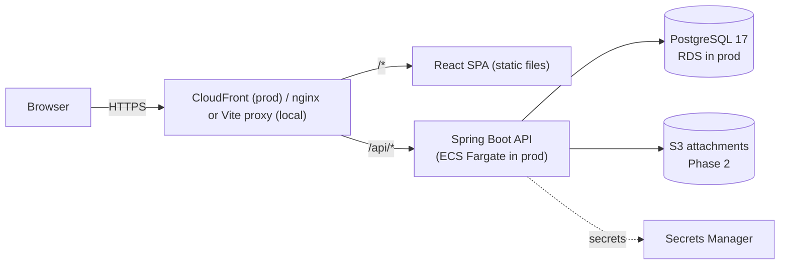
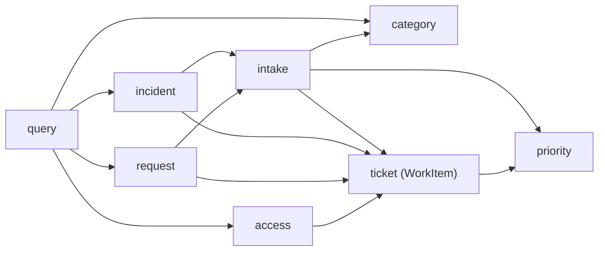
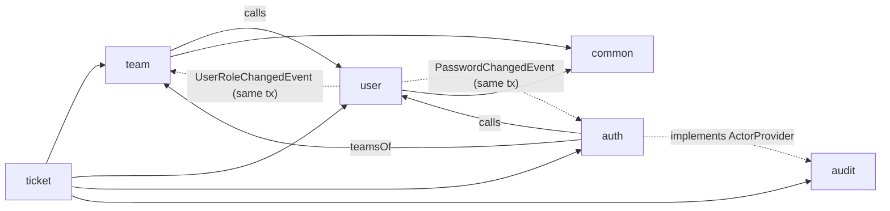

# Architecture

> Sections marked **(planned)** describe approved design that isn't implemented yet. They're updated
> as each milestone lands.

## Style: modular monolith

One deployable Spring Boot application, split internally into domain modules with explicit
boundaries. See [ADR-001](adr/001-modular-monolith.md).

**The SPA and API share one origin.** `/api/*` is routed to the backend by the edge (CloudFront in
production, the Vite dev proxy or nginx locally). This removes CORS from production and lets the
refresh-token cookie be `SameSite=Strict`.

## Backend modules

Base package: `com.ademola.esm`

| Module | Responsibility | Status |
|---|---|---|
| `common` | Error model (`ErrorCode`, `DomainException`, `GlobalExceptionHandler`), web (`CorrelationIdFilter`, `PageResponse`, `SortableFields`), persistence (`BaseEntity`), injectable `Clock` | Implemented (M0–M1) |
| `config` | Cross-cutting Spring configuration (OpenAPI, later Jackson/web) | Implemented (M0) |
| `auth` | Security filter chain, role hierarchy, JWT issue/validation, refresh-token rotation, login/refresh/logout, `/api/users/me` | Implemented (M0–M2) |
| `user` | Users, roles, password hashing and change, first-admin bootstrap, admin user API | Implemented (M1–M2) |
| `team` | Teams, membership, admin team API, team read API | Implemented (M1) |
| `ticket` | Work-item kernel (`WorkItem`, references) plus `priority`, `category`, `intake`, `incident`, `request`, `access`, `query` sub-packages; `workflow`, `assignment`, `comment` to come | Core implemented (M3) |
| `audit` | Append-only audit trail; `ActorProvider` port implemented by `auth` | Implemented (M3) |
| `sla`, `catalogue`, `approval`, `attachment`, `notification` | Phase 2 | Planned |
| `reporting` | Read-only aggregate queries | Planned (Phase 3) |

### Module conventions

- **Package by feature, not by layer.** Each module holds its own controller, service, repository,
  entities and DTOs. Classes are package-private where possible, so the compiler enforces
  boundaries.
- **Controllers are thin.** They validate input, call one service method, and map the result to a
  response DTO. Business rules live in services and entities.
- **JPA entities never leave the service layer.** Controllers return Java `record` DTOs.
- **No Lombok or MapStruct.** Records and explicit mapping methods keep the code transparent.
- **Modules reference each other's aggregates by ID**, not JPA associations. For example,
  `TeamMember` stores a `userId`.
- **Dependencies point one way, and events carry the reverse direction.** `team` depends on `user`.
  When `user` needs `team` to react (a user demoted to REQUESTER must leave all teams), it publishes
  `UserRoleChangedEvent` and `team` listens. Listeners are synchronous and run in the same
  transaction, so the change is atomic. Phase 2 uses the same pattern for ticket → SLA.

Inside `ticket`, packages form a one-way graph (no cycles):

Across modules:

## Request lifecycle (implemented)

1. `CorrelationIdFilter` (highest precedence) accepts a safe `X-Request-Id` or generates one, stores
   it in the SLF4J MDC, and echoes it in the response.
2. The Spring Security filter chain runs. `BearerTokenAuthenticationFilter` verifies the JWT, and
   `CurrentUserJwtConverter` turns its claims into a `CurrentUser` principal. URL rules then apply
   (public: health, docs, `/api/auth/*`; ADMIN: `/api/admin/**`; everything else needs
   authentication).
3. Spring MVC dispatches to a controller.
4. Any exception, including authentication and access-denied failures delegated from Spring
   Security, is rendered by `GlobalExceptionHandler` as `application/problem+json`.

## Configuration

- 12-factor: environment variables (`ESM_DB_URL`, `ESM_DB_USERNAME`, `ESM_DB_PASSWORD`, ...).
- Locally, Spring imports the git-ignored repository-root `.env` (`spring.config.import`), so
  docker-compose and the backend read the same single file.
- The `prod` profile switches to JSON (ECS) structured logs and disables API docs.
- `spring.jpa.open-in-view=false` stops lazy loading during JSON rendering, which would hide N+1
  queries.
- `ddl-auto=validate`: Flyway owns the schema, and Hibernate only verifies it.

## API (implemented so far)

| Method & path | Who | Notes |
|---|---|---|
| `POST /api/auth/login` | anyone | `{email, password}` → `{accessToken, tokenType, expiresIn, user}` + refresh cookie |
| `POST /api/auth/refresh` | refresh cookie | Rotates the cookie, returns a new access token |
| `POST /api/auth/logout` | refresh cookie | 204; revokes the session family, clears the cookie |
| `GET /api/users/me` | any signed-in user | Profile + active teams |
| `POST /api/users/me/password` | any signed-in user | `{currentPassword, newPassword}`; 204; ends all sessions |
| `POST /api/admin/users` | ADMIN | 201 + `Location`; 409 `EMAIL_ALREADY_EXISTS` |
| `GET /api/admin/users?q&role&active&page&size&sort` | ADMIN | Paged; sort by `email`, `displayName`, `role`, `createdAt` |
| `GET /api/admin/users/{id}` | ADMIN | |
| `PATCH /api/admin/users/{id}` | ADMIN | `{displayName?, role?, active?, version}`; 409 on stale version or last admin |
| `GET /api/teams`, `GET /api/teams/{id}`, `GET /api/teams/{id}/members` | AGENT+ | Active teams only |
| `GET /api/admin/teams`, `POST /api/admin/teams`, `PATCH /api/admin/teams/{id}` | ADMIN | Includes inactive teams |
| `PUT / DELETE /api/admin/teams/{id}/members/{userId}` | ADMIN | Idempotent, 204 |

### Tickets & categories (M3)

| Method & path | Who | Notes |
|---|---|---|
| `POST /api/incidents` | any signed-in user | `{title, description, categoryId, subcategoryId?, impact, urgency, affectedService?}` → 201 `{id, reference, type, status, priority}` + `Location: /api/tickets/{id}` |
| `POST /api/service-requests` | any signed-in user | `{title, description, categoryId, subcategoryId?, urgency?}`; impact defaults LOW, urgency MEDIUM |
| `GET /api/tickets/{id}` | owner / team staff / admin | Full ticket with names resolved; **404** if not visible |
| `GET /api/categories?type=INCIDENT\|SERVICE_REQUEST` | any signed-in user | Active category tree for that type |
| `GET/POST /api/admin/categories`, `PATCH /api/admin/categories/{id}` | ADMIN | Code is immutable; top level needs a team; max two levels |

## Ticket intake (M3)

Every new ticket, of any type, goes through `TicketIntake`, in one transaction:

1. **Category check:** active, top-level, applicable to the type; the subcategory must belong to it.
   Failures are 422 `INVALID_CATEGORY` (never 404, which would allow probing for ids).
2. **Routing:** subcategory team ?? category team; that team must be active.
3. **Priority:** `PriorityPolicy` (below).
4. **Reference:** `nextval` on the type's sequence → `INC-000042`.
5. Save, then **audit** `TICKET_CREATED` in the same transaction.

### Priority matrix

Configured in `application.yml` (`esm.priority.matrix`), bound to a validated record. Startup
fails if any cell is missing. `PriorityPolicy` is the only code that maps impact/urgency to
priority.

| Impact \ Urgency | HIGH | MEDIUM | LOW |
|---|---|---|---|
| **HIGH** | P1 Critical | P2 High | P3 Medium |
| **MEDIUM** | P2 High | P3 Medium | P4 Low |
| **LOW** | P3 Medium | P4 Low | P4 Low |

## Audit trail (M3)

- `AuditService.record()` uses `Propagation.MANDATORY`: callable only inside the business
  transaction, so a change and its audit entry commit or roll back together (tested: a failed
  duplicate-email create leaves no audit row).
- The actor comes from `ActorProvider` (implemented by `auth` from the JWT principal; empty for
  system actions such as the admin bootstrap). The correlation id comes from the MDC.
- Audited so far: user created/updated/password changed, team created/updated/member
  added/removed, category created/updated, ticket created. Values hold only changed fields and never
  secrets.
- Append-only at three levels: `@Immutable` entity, a repository with no update/delete methods, and
  a database trigger.

## Observability (implemented so far)

- Correlation ID on every log line (`logging.pattern.correlation`) and in every error response.
- Actuator `health`, `health/liveness` and `health/readiness` are public, with no component
  details. Every other actuator endpoint is unexposed.

## Phase 1 milestones

| # | Milestone | Status |
|---|---|---|
| M0 | Bootstrap: monorepo, Spring Boot, Flyway, Compose, error handling, correlation IDs, Testcontainers | **Done** |
| M1 | Users & teams, role hierarchy, admin APIs | **Done** |
| M2 | Authentication: login, JWT, refresh-token rotation, `/users/me`, bootstrap admin | **Done** |
| M3 | Ticket core + audit foundation | **Done** |
| M4 | Workflow engine | Next |
| M5 | Assignment & routing | |
| M6 | Comments & internal notes, history endpoint | |
| M7 | Queue, filtering, full-text search | |
| M8 | OpenAPI polish, `docs/api.md` | |
| M9 | Frontend foundation (auth, layout, generated API types) | |
| M10 | Requester portal | |
| M11 | Agent portal | |
| M12 | Full Docker Compose, production Dockerfiles, seed data | |
| M13 | GitHub Actions CI | |
| M14 | Documentation, ADRs, screenshots | |
