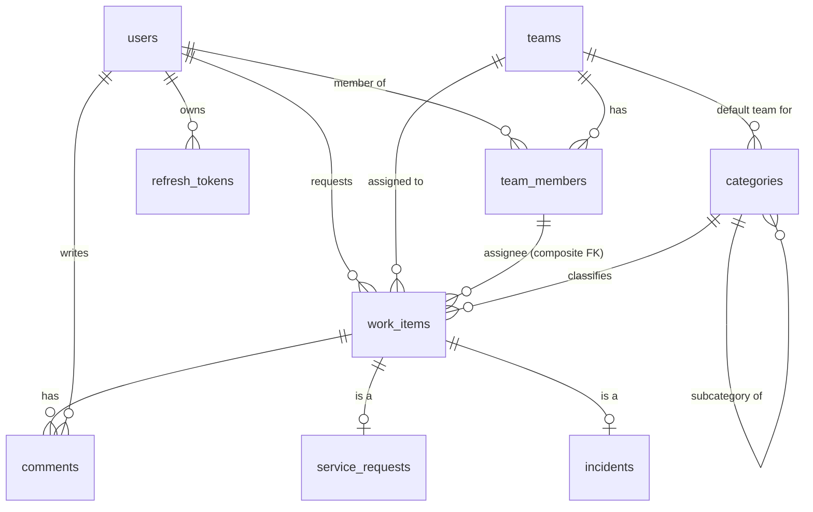

# Database design

PostgreSQL 17 ([ADR-002](adr/002-postgresql.md)). Every schema change is a Flyway migration in
`backend/src/main/resources/db/migration`. Hibernate validates the schema and never creates it.

## Implemented

| Migration | Contents |
|---|---|
| `V1__baseline.sql` | No tables. Proves the migration pipeline end to end |

## Conventions

- Migrations are **immutable once merged**. A fix is a new migration.
- Primary keys are `uuid`. Human-readable references (`INC-000001`) are a separate unique column.
- All timestamps are `timestamptz`, and the application reads and writes UTC.
- Mutable aggregates have a `version bigint` column for optimistic locking.
- Enumerations are stored as `varchar` with a `CHECK` constraint, so they stay readable in SQL,
  remain migration-friendly, and still get database-level validation.
- Business invariants are enforced in the service **and**, where cheap, in the database.

## Phase 1 schema (planned, approved design)

Key decisions (details are recorded in the milestone that implements them):

- **One `work_items` table plus one extension table per type** (JPA `JOINED` inheritance). Queues,
  search, comments, audit and SLA all need a single foreign-key target across types.
- **Reference numbers come from one PostgreSQL sequence per type.** Sequences are atomic, so there
  are no race conditions. Gaps after a rollback are acceptable.
- **`assigned_team_id` is NOT NULL.** Routing always sets a team, so the "unassigned queue" means
  `assignee_id IS NULL`.
- **Composite FK `(assigned_team_id, assignee_id)` → `team_members`.** The database rejects an
  assignee who isn't a member of the assigned team.
- **`audit_events` is append-only**, enforced by a trigger that rejects `UPDATE` and `DELETE`.
