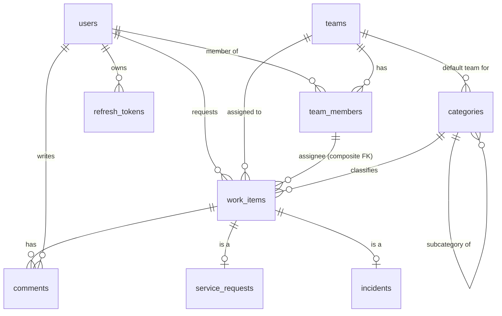

# Database design

PostgreSQL 17 ([ADR-002](adr/002-postgresql.md)). Every schema change is a Flyway migration in
`backend/src/main/resources/db/migration`. Hibernate validates the schema and never creates it.

## Implemented

| Migration | Contents |
|---|---|
| `V1__baseline.sql` | No tables. Proves the migration pipeline end to end |
| `V2__users_and_teams.sql` | `users`, `teams`, `team_members` (M1) |
| `V3__refresh_tokens.sql` | `refresh_tokens` (M2) |
| `V4__tickets_and_audit.sql` | `categories`, `work_items`, `incidents`, `service_requests`, reference sequences, `audit_events` + append-only trigger (M3) |
| `V5__assignment_membership_rules.sql` | Replaces V4's composite assignee FK with two triggers (see below); index `(assigned_team_id, assignee_id)` (M5) |
| `V6__comments.sql` | `comments` (M6) |

### users

| Column | Type | Notes |
|---|---|---|
| `id` | `uuid` PK | UUIDv7, generated by the application (time-ordered, so B-tree friendly) |
| `email` | `varchar(254)` NOT NULL | `UNIQUE`; `CHECK (email = lower(btrim(email)))` makes the unique constraint case-insensitive |
| `display_name` | `varchar(120)` NOT NULL | not blank |
| `password_hash` | `varchar(255)` NOT NULL | `{bcrypt}…`; the algorithm prefix allows a later migration to Argon2 |
| `role` | `varchar(20)` NOT NULL | `CHECK IN (REQUESTER, AGENT, TEAM_LEAD, ADMIN)` |
| `active` | `boolean` | Users are deactivated, never deleted |
| `created_at`, `updated_at` | `timestamptz` | |
| `version` | `bigint` | Optimistic locking |

Index: `(role, active)` serves the "active admins" lock query and role filters.

### teams

`id`, `name varchar(100)`, `description varchar(500)`, `active`, timestamps, `version`.
Unique index on `lower(name)` ("Network Team" and "network team" can't coexist), and the name
can't be blank.

### team_members

`team_id → teams`, `user_id → users`, `joined_at`; **PK `(team_id, user_id)`**, plus an index on
`user_id` for "teams of a user". Foreign keys use the default `RESTRICT`, so a user or team with
memberships can't be hard-deleted.

### refresh_tokens

| Column | Notes |
|---|---|
| `id` uuid PK, `user_id` → users | |
| `family_id` uuid | All tokens from one login. Revocation is per family |
| `token_hash` varchar(64) | SHA-256 hex of the cookie value; `UNIQUE`; `CHECK` hex format |
| `issued_at`, `expires_at` | `CHECK (expires_at > issued_at)`; successors inherit `expires_at` (absolute session) |
| `used_at` | Set on rotation; a used token presented again means reuse |
| `revoked_at`, `revocation_reason` | Both null or both set (CHECK); reason in `LOGOUT, REUSE_DETECTED, PASSWORD_CHANGED, USER_INACTIVE` |

Indexes: `family_id`, `user_id`, `expires_at` (for the future purge job).

### categories

Two levels (`parent_id` → top-level category). `code` is unique UPPER_SNAKE_CASE; `applies_to` is
`INCIDENT | SERVICE_REQUEST | ANY`. **`CHECK (parent_id IS NOT NULL OR default_team_id IS NOT NULL)`**:
every top-level category routes to a team, so every ticket is routable. A subcategory's team, if
set, overrides its parent's.

### work_items, incidents, service_requests (JPA `JOINED` inheritance)

`work_items` holds every shared column: `reference` (unique, `^(INC|REQ)-[0-9]{6,}$`), `type`
(discriminator), `title`, `description`, `status`, `impact`, `urgency`, `priority`, `category_id`,
`subcategory_id`, `requester_id`, `assigned_team_id` (**NOT NULL**), `assignee_id`, lifecycle
timestamps and `version`. `incidents` and `service_requests` share its primary key
(`work_item_id`, `ON DELETE CASCADE`) and add type-specific columns.

| Guarantee | Mechanism |
|---|---|
| Status belongs to the type | `work_items_status_check`: `(type, status)` pairs |
| Unique, race-free references | `incident_ref_seq` / `service_request_ref_seq` + `UNIQUE (reference)` |
| Assignee is in the assigned team **when assigned** | trigger `work_items_assignee_membership` (BEFORE INSERT/UPDATE OF assignee/team) |
| A member can't leave a team while owning **open** tickets there | trigger `team_members_no_open_assignments` (BEFORE DELETE) |
| Valid impact/urgency/priority | `CHECK ... IN (...)` |

Indexes: `(requester_id, created_at DESC)` for "my tickets", `(assigned_team_id, status)` and
`(assignee_id, status)` for queues, `(created_at)` for reporting. Queue-specific and full-text
indexes are added in M7, sized against real query plans.

> **Why triggers instead of the original composite FK (V4 → V5):** a foreign key holds for the
> row's whole life. Closed tickets keep their historical assignee, so the FK made it impossible to
> ever remove someone from a team they had once worked in. The real rule is about *assignment time*
> and *open* tickets, which a trigger can express. See [ADR-008](adr/008-assignment-membership-triggers.md).

### comments

`work_item_id` → work_items (`ON DELETE CASCADE`), `author_id` → users, `visibility`
(`PUBLIC | INTERNAL`), `body` (not blank, at most 10,000 characters, both CHECKs), `related_status`
(set when the comment is the reason for a status change), `created_at`. Index
`(work_item_id, created_at, id)` serves the thread in order. Immutable in the application.

### audit_events

`occurred_at`, `actor_id` (NULL = system), `action`, `entity_type`, `entity_id`, `old_value` /
`new_value` / `metadata` (**jsonb**), `correlation_id`. No foreign keys, so the trail never blocks
or depends on what it describes. **A `BEFORE UPDATE OR DELETE` trigger raises `restrict_violation`**,
making it append-only at the database level. Indexes: `(entity_type, entity_id, occurred_at)` for
timelines and `(actor_id, occurred_at)`.

## Conventions

- Migrations are **immutable once merged**. A fix is a new migration.
- Primary keys are `uuid`. Human-readable references (`INC-000001`) are a separate unique column.
- All timestamps are `timestamptz`, and the application reads and writes UTC.
- Mutable aggregates have a `version bigint` column for optimistic locking.
- Enumerations are stored as `varchar` with a `CHECK` constraint, so they stay readable in SQL,
  remain migration-friendly, and still get database-level validation.
- Business invariants are enforced in the service **and**, where cheap, in the database.

## Phase 1 entity relationships

Tables still to come in Phase 2: (`sla_*`, `catalogue_items`, `approvals`,
`problems`, `changes`, `attachments`, `notifications`).
