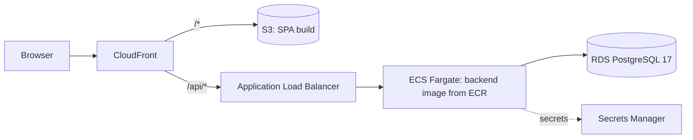

# Deployment

> **Current status:** containerised and runnable locally with Docker Compose. AWS deployment is
> planned for Phase 3 and **does not exist yet**; the target design is described at the end.

## Images

| Image | Build | Runtime | Size (uncompressed, local) |
|---|---|---|---|
| `backend` | `eclipse-temurin:21-jdk`, Maven wrapper; dependencies resolved in their own cached layer; tests skipped (they run in CI first) | `eclipse-temurin:21-jre`, Spring Boot **layered jar** extracted as dependencies → loader → snapshots → application, **uid 10001**, `-XX:MaxRAMPercentage=75 -XX:+ExitOnOutOfMemoryError` | 615 MB |
| `web` | `node:22-alpine`, `npm ci` + type-check + Vite build | `nginx-unprivileged:1.29-alpine` (**uid 101**) serving `dist/` | 83 MB |

- **Layering:** a code change rebuilds and re-pushes only the small application layer, not the
  ~100 MB of dependencies.
- **No secrets in images:** all configuration arrives as environment variables at runtime.
- The backend image is mostly the Ubuntu-based JRE. An Alpine or distroless JRE would shrink it;
  this is listed under future work and not done yet.

## nginx (web container)

- Serves the SPA with fallback to `index.html` for client-side routes.
- **Proxies `/api/` to the backend**, so the browser sees one origin. That's the same layout
  CloudFront provides in production: no CORS, and the `SameSite=Strict` refresh cookie works unchanged.
- Caching: `index.html` is `no-cache` (new deploys are picked up immediately); `/assets/*` are
  content-hashed, so `public, immutable` for one year.
- Security headers on every response, via a snippet included in **each** location. nginx drops
  inherited `add_header`s when a location defines its own, so server-level headers alone would
  silently vanish on `/assets/`. Verified with `curl -I` on both.
- **Content-Security-Policy:** `script-src 'self'` (no inline scripts), `connect-src 'self'`,
  `frame-ancestors 'none'`, `object-src 'none'`. `style-src` includes `'unsafe-inline'` because
  Radix's dialog scroll lock injects a `<style>` element. This was verified by removing it and
  watching Chrome block the style. A per-style hash would be tighter but brittle across library
  updates.

## Docker Compose

```
postgres (pg_isready) ──healthy──▶ backend (/actuator/health/readiness) ──healthy──▶ web (nginx)
```

| Service | Exposed on the host | Notes |
|---|---|---|
| `postgres` | `127.0.0.1:5432` | Databases `esm` (IDE development) and `esm_demo` (containerised stack), created by `docker/postgres-init` on first volume creation |
| `backend` | **not published** | Profiles `prod,demo`: JSON logs, no Swagger, demo seed. Health check uses bash `/dev/tcp` because the JRE image has no curl |
| `web` | `127.0.0.1:3000` | The only entry point |

- Ports bind to `127.0.0.1` only, so nothing is reachable from your network.
- **Existing volumes:** the init script only runs when the Postgres volume is created. On a volume
  from before M12, create the demo database once:
  `docker compose exec postgres psql -U esm -d esm -c "CREATE DATABASE esm_demo"`.

## Demo data

The `demo` profile runs `DemoDataSeeder` at startup:

- It creates people, teams, categories and 8 tickets (P1 unassigned, waiting for user, resolved
  awaiting confirmation, closed, fulfilled request, unassigned request, lead-assigned, cancelled)
  **through the application's services**, signed in as the relevant user at each step. The data
  therefore obeys every business rule and has a real audit history.
- It's idempotent (skips if `admin@demo.local` exists) and refuses to start without
  `ESM_DEMO_PASSWORD` of at least 12 characters.
- **It is a local-demo feature only.** A public deployment must not enable the `demo` profile
  with documented passwords.

## Production target (Phase 3, planned)



The same backend image runs there with `SPRING_PROFILES_ACTIVE=prod`; the readiness and liveness
endpoints back the ALB and ECS health checks. Infrastructure as code (Terraform), migrations as a
one-off task before the service update, and the CI/CD pipeline are Phase 3 work.
